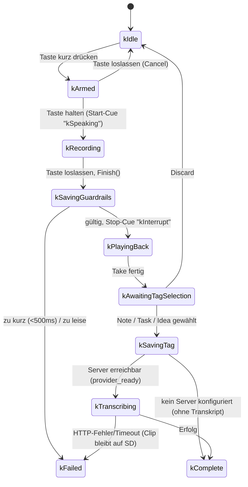
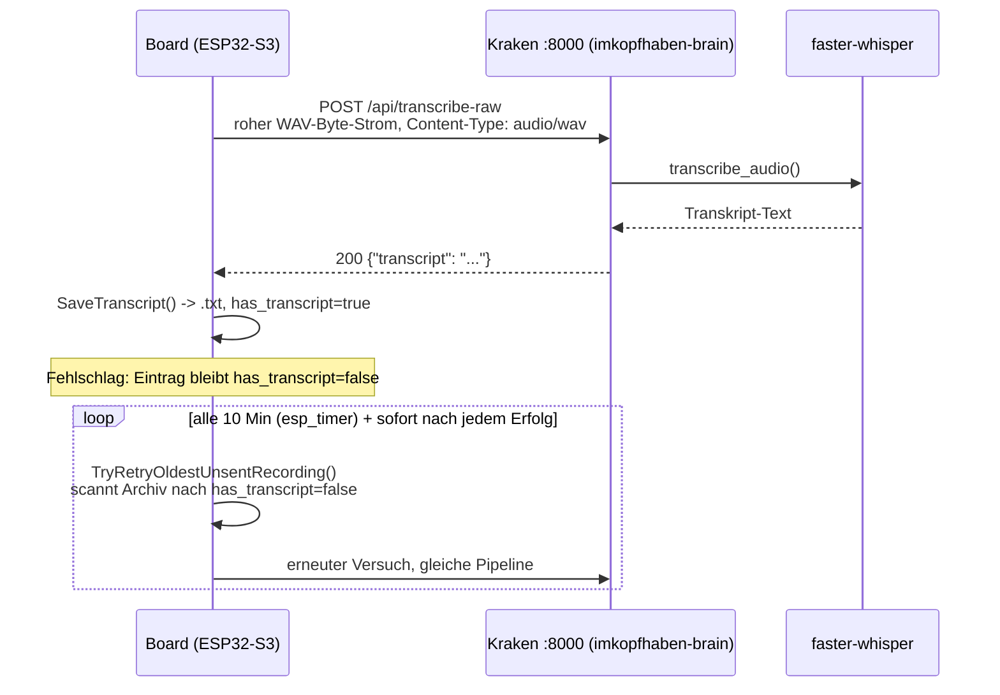
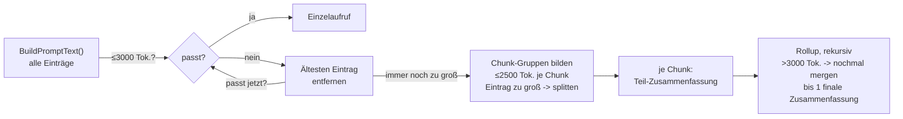
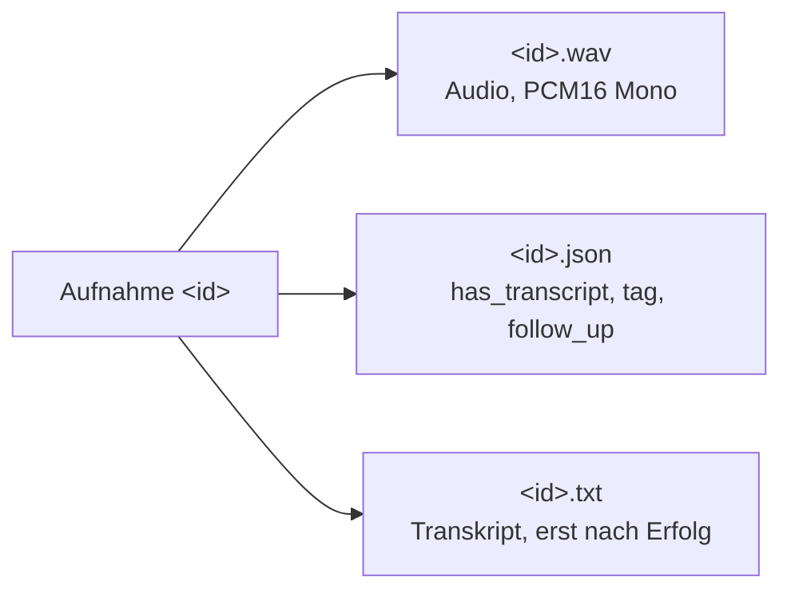

# Wie das Sticky-Note-Gerät funktioniert

Stand 2026-09-02, aus dem tatsächlichen Firmware- und Backend-Code
entnommen (nicht aus anderer Doku geraten). Zustandsnamen, Funktionsnamen
und Konstanten wie im Quelltext. Visuelle Fassung (SVG, gleiche Inhalte)
als Artefakt: siehe Chat-Session, sonst reicht diese Datei.

## 1. Aufnahme-Ablauf

Ein Tastendruck durchläuft `recording_session_service` als
Zustandsautomat. Zwei Punkte heißen im Code beide `kSaving` — einmal
direkt nach der Aufnahme (Gültigkeits-Prüfung), einmal nach der
Kategorie-Wahl (Archivierung).



Guardrails (`ValidateClip`): Mindestdauer `kMinTranscriptionDurationMs =
500ms`; Lautstärke-Erkennung über gleitende Fenster
(`kSignalWindowSamples=240`, Peak-Schwelle `kSpeechPeakThreshold=700`,
mind. `kMinSpeechWindows=3` laute Fenster). Ein Fehlerpfad heißt aber
nicht Datenverlust — der Clip liegt zu diesem Zeitpunkt schon auf SD,
es fehlt nur das Transkript.

## 2. Tagging

4 Optionen (`kTagOptions`): `Note`, `Task`, `Idea`, `Discard`. Discard
verwirft den Clip (`DiscardClip()`). Sonst `recording_archive_service::
SaveClip()` mit gewähltem Tag.

## 3. Transkription & Offline-Warteschlange



`local_ai_service::PostWavClip()` baut den WAV-Header selbst und streamt
PCM16-Mono-Samples als **rohen HTTP-Body** — kein Multipart. Kraken-Seite:
`~/imkopfhaben-brain/main.py`, `POST /api/transcribe-raw`, nutzt dasselbe
schon geladene Whisper-Modell wie `/api/process-audio`. Retry-Intervall:
`kTranscriptionRetryIntervalUs` = 10 Minuten, plus Sofort-Trigger
(`RequestRetryPass`) nach jeder erfolgreich gespeicherten Transkription,
damit die Warteschlange schnell abgebaut wird, sobald die Verbindung
wieder steht. Manuelle Re-Transkription (`BeginArchivedTranscription`)
nutzt dieselbe Pipeline, aufgerufen von den Seiten `details` und
`vibe_check`.

## 4. Zusammenfassung

`summary_service` nutzt denselben Kraken-Sprung
(`local_ai_service::GenerateText()` → LM Studio `/v1/chat/completions`,
`google/gemma-4-e2b`, Pflichtfeld `reasoning_effort: "none"`), aber ohne
Warteschlange — dafür mit einer eigenen Map-Reduce-Pipeline, falls die
Transkripte nicht in einen Prompt passen. Zwei Varianten:
`SummaryKind::kNotes` und `SummaryKind::kTodos` — kein Tagebuch, das ist
ein anderes Projekt (`imkopfhaben-public`). Zeitfenster:
`kSummaryWindowDays = 3` Tage.

### Der Prompt selbst

Englisch, unabhängig von der sonst deutschen Projektsprache — Modell und
Prompt-Muster geben das so vor. Finale Fassung für `SummaryKind::kNotes`
(`BuildSummaryInstructionText(kind, intermediate=false)` +
`AppendSourceEntriesToPrompt()`):

```
Summarize the notes captured within the available transcripts. Create a
summary capturing the main themes, decisions, follow-ups, open questions,
and ideas in plain text. Keep it concise, and write it in an encouraging
and optimistic tone so it feels insightful and motivating to look back on.
Use short paragraphs and avoid markdown tables.

Source entries:

Entry 1:
Date: 2026-09-01
Transcript:
<Rohtranskript der Aufnahme>

Entry 2:
...

Now write the final summary for the Notes. Put the summary only in the response.
```

Für `kTodos` bekommt jeder Eintrag zusätzlich eine `Completed: Yes/No`-
Zeile (aus dem Tag-Metadaten-Flag), und die Instruktion fragt nach
Prioritäten/erledigter Arbeit/Blockern statt Themen/Ideen.

### Budget-Kaskade

Token-Schätzung = `Zeichenzahl / 4` (kein echtes Tokenizer-Endpoint auf
LM Studio verfügbar — `/v1/internal/tokenize` liefert "Unexpected
endpoint", verifiziert).

| Konstante | Wert | Bedeutung |
|---|---|---|
| `kSummaryInputTokenBudget` | 3000 | Grenze für den Einzelaufruf |
| `kSummaryChunkTokenBudget` | 2500 | Grenze pro Map-Chunk |
| `kSummaryRollupTokenBudget` | 3000 | Grenze pro Rollup-Merge |



`GenerateSummary()` → `GenerateChunkedSummary()` →
`GenerateRollupSummaryRecursive()`. Map-Chunks bekommen die
"intermediate"-Instruktion (faktisch, kompakt), nur der letzte
Rollup-Schritt bekommt die finale, ermutigende Tonalität.

## 5. Ablage pro Aufnahme

Drei Dateien pro `<id>`:



`recording_archive_service`. `storage_service::Mode::kUsbMounted` stellt
die SD-Karte alternativ als USB-Massenspeicher bereit — die App hat
währenddessen keinen Dateizugriff.

## 6. Bildschirme

Elf Seiten, jede als eigener Coordinator/Runtime/Interactions-Dreisatz
unter `main/`:

| Seite | Zeigt / kann |
|---|---|
| `dashboard` | Startbildschirm, Datum, Einstiegspunkt in die anderen Seiten |
| `details` | Einzelansicht einer Aufnahme, inkl. manuellem Retranskribieren |
| `notes` | Aufnahmen mit Tag Note oder Idea |
| `todos` | Aufnahmen mit Tag Task |
| `follow_up` | Einträge mit gesetztem `follow_up`-Flag |
| `vibe_check` | Schnelle Behalten/Verwerfen-Entscheidung, optional mit Transkribieren-Aktion |
| `summarize` | Zusammenfassung für Notes oder Todos anstoßen |
| `settings` | Geräte-Einstellungen, u. a. lokale-KI-URLs |
| `wifi` | Netzwerk-Auswahl und -Einrichtung |
| `time` | Zeitzone und Uhrzeit |
| `onboarding` | Ersteinrichtungs-Slides beim ersten Start |

## 7. WLAN, Energie, Konfiguration

| Bereich | Zustand / Wert | Quelle |
|---|---|---|
| WLAN | Scanning → Connecting → Connected / Disconnected / **AccessPointMode** (Ersteinrichtung, Portal erreichbar) | `wifi_service` |
| Energie | kAwake → kDisplaySleeping → kLightSleeping; Aufwecken per IMU-Bewegung oder Interaktion | `device_sleep_service` |
| Display-Sleep-Timeout | 180 s | `FOLLOWUP_AUTO_SLEEP_DISPLAY_SLEEP_TIMEOUT_SECONDS` |
| Light-Sleep-Timeout | 1800 s | `FOLLOWUP_AUTO_SLEEP_LIGHT_SLEEP_TIMEOUT_SECONDS` |
| Akku | AXP2101-PMIC, echter Coulomb-Counter — kein Lerner nötig | `axp2101` |
| Aufnahme-Mindestdauer | 500 ms | `kMinTranscriptionDurationMs` |
| Transkriptions-Timeout | 30 s | `kTranscribeTimeoutMs` |
| Retry-Intervall | 10 Min, plus Sofort-Trigger nach Erfolg | `kTranscriptionRetryIntervalUs` |
| KI-Modell | google/gemma-4-e2b, reasoning_effort=none | `FOLLOWUP_LOCAL_AI_MODEL_NAME` / `_REASONING_EFFORT` |

---

Quellen: `recording_session_service` · `local_ai_service` ·
`transcription_service` · `summary_service` · `recording_archive_service`
· `wifi_service` · `device_sleep_service` · `imkopfhaben-brain/main.py`
